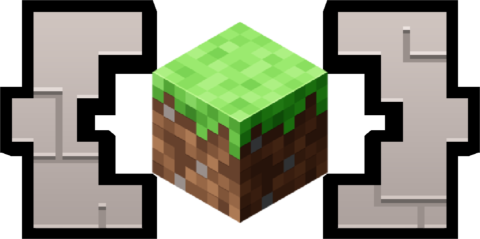

    
    

## **A Minecraft based interactive programming education platform**

## 🔧 Use Cases

- **Education**: CodeCraft provides a **real-time** **interactive** **game-based** teaching environment,
  serving as a new approach to **interest driven leaning** and **learn-by-doing**.
  Suitable for individual learners and educators.
- **Technical Minecraft**: CodeCraft is a great tool for technical Minecraft players,
  it's fully **real-time**, **programmatic** and very **extensible**.
    - Working on a **redstone computer**? 
      No need to use world editors to **load you programs** and do the boot sequence by hand everytime,
      just write a straight-forward **python script** for that. 
      You could even make a **debugger** for your redstone computer, taking advantage of CodeCraft's **real-time**
      nature.
    - Trying to **research the RNG algorithm**? 
      Use CodeCraft to step through every tick, inspect the RNG state. Or even hook into each RNG call by writing a
      simple CodeCraft extension.
- **Creative Coding**: use CodeCraft to make **cool thing** in Minecraft!
    - Animations videos
    - Fractals
    - Bad Apple videos
    - ······

## ⚙️ Features

TODO......